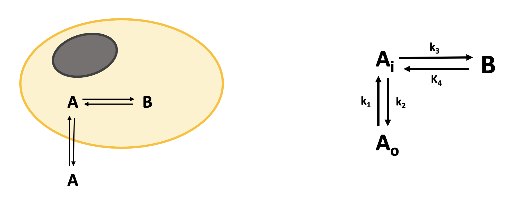
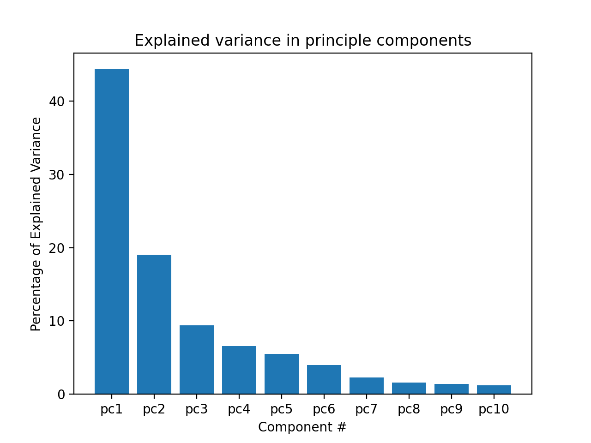
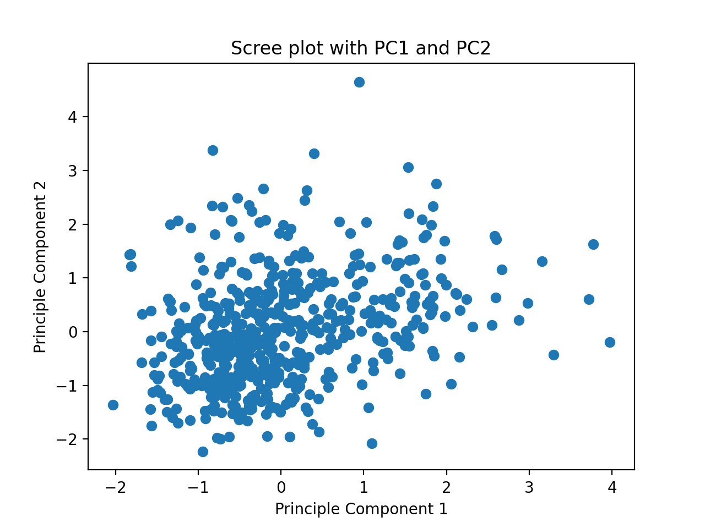

# BME631 - Homework 2 - Nathan LeRoy - 09/15/2021

## Problem 1
To implement a Gaussian Elimination algorithm in Python, I am employing a similar strategy to that laid out in _Numerical Recipes_ where a matrix is first row reduced to row echelon form, and then a backsweep is calculated to solve the full matrix and find it's corresponding solutions [@criminsNumericalRecipesArt2003] A high level view of my procedure is laid out here in brief:

1. Convert matrices to correct data types.
2. Create augmented matrix from equation matrix and solution vector.
3. Calculate matrix stats (# of rows / # of columns).
4. Verify pivot elements of matrix.
5. Reduce matrix to row echelon form.
6. Backweep to calculate solutions.

In step 4, to verify the pivot elements of the matrix we check each value on the diagonal (i.e. $a_{i,i}$) for a zero value. If this is the case, the row is swapped with the preceding one and the matrix is verified again. The matrix is row reduced using standard elementary row operations in an algorithmic manner where a ratio between the leading elements of two rows are calculated and used to reduce the row (See attachment for the full code). 

```python
# for each column in the matrix (minus solution set)
for i in range(cols-1):
    # iterate over each row
    # but only need to start at row below triangle
    # we are creating... i.e. full_col + 1
    for j in range(i+1,rows):
        
        # calculate the ratio used in
        # the row matrix calculations
        ratio = aug_A[j][i]/aug_A[i][i]
        
        # apply calculations to each
        # col in the matrix in row j
        for k in range(cols):
            aug_A[j][k] += -1 * ratio * aug_A[i][k]
```

Once the algorithm gets through this, it conducts a back propagation to solve for the solutions ($x_{i}$) using the following formula:

$$
x_{i} = \dfrac{1}{a_{ii}}[b_{i} - \displaystyle\sum^{N}_{j=i+1}a_{ij}x_{j}]
$$

Here is the code to achieve this:

```python
for i in range(rows-1, -1, -1):
    # init backsweep sum
    b_sum = 0
    for j in range(i+1, rows):
        b_sum += aug_A[i][j]*sol[j]
    sol[i] = (1 / aug_A[i][i]) * (aug_A[i][-1] - b_sum)
```

To test my function, the following system of equations was set up:

$$
4x_{1} - 2x_{2} + 3x_{3} = 1
$$
$$
x_{1} + 3x_{2} - 4x_{3} = -7
$$
$$
3x_{1} + x_{2} + 2x_{3} = 5
$$

The system can be converted to the following maxtrix formula:

$$
\begin{bmatrix}
  4 & -2 & 3 \\
  1 & 3 & -4 \\
  3 & 1 & 2
\end{bmatrix}
\begin{bmatrix}
  x_{1} \\
  x_{2} \\
  x_{3} \\
\end{bmatrix}
 =
\begin{bmatrix}
1 \\
-7 \\
5
\end{bmatrix}
$$

Running the following code:
```python
# test data
test_A = np.array([
    [4, -2, 3],
    [1, 3, -4],
    [3, 1, 2],
])

test_b = np.array([1, -7, 5])

# perform gaussian elimination
solution = gaussian_elim(test_A, test_b)
```
Produces the following result:

```
>>> [-1.  2.  3.]
```

## Problem 2
To demonstrate the function of my Gaussian function, I am proposing an extremely simple cell model:

A single cell is placed in an abundance of media containing substance **A**. **A** is imported via active transport, but can be modeled via first order reaction kinetics. Once inside, **A** will be converted into **B*** (also via first order kinetics) in addition to slowly and passively _leaking_ out of the cell. This network is described in Fig. 1 below:



Using this network we can write out some equations for each of the 3 substances:

$$
\dfrac{dA_{o}}{dt} = k_{2}A_{i} - k_{1}A_{o}
$$

$$\dfrac{dA_{i}}{dt} = -(k_{2} + k_{4})A_{i} + k_{1}A_{o} + k_{3}B$$

$$\dfrac{dB}{dt} = k_{3}A_{i} - k_{4}B$$


Since our cell is in an abundance of media, we can assume that $[A_{o}]$ is constant and this the top equation can be discarded, and all $A_{o}$ can be replaced with constant values when evaluating. We are interested in the concentration of B in the cell at **_steady-state_** and thus, can set the left side of our equation to 0 while converting to matrix form:

$$
\begin{bmatrix}
    -(k_{2} + k_{4}) & k_{3}\\
    0 & k_{3} & -k_{4}
\end{bmatrix}
\begin{bmatrix}
   A_{i} \\ B
\end{bmatrix}
=
\begin{bmatrix}
    k_{1}A_{o} \\ 0
\end{bmatrix}
$$

Setting the following values for our reaction constants:

$k_{1} = 1$
$k_{2} = 0.001$
$k_{3} = 10$
$k_{4} = 0.1$
$[A_{0}] = 10 mMol$

We can now substitute into out above matrix and solve for the steady-state values of $A_{o}$, $A_{i}$, and $B$:

$$
\begin{bmatrix}
    -0.1001 & 10\\
    10 & 0.1
\end{bmatrix}
\begin{bmatrix}
    A_{i} \\ B
\end{bmatrix}
=
\begin{bmatrix}
    10 \\ 0
\end{bmatrix}
$$

Plugging into the Gaussian elimination algorithm I wrote in [Problem 1](#Problem 1) we can see that $[B]$ inside our cell at steady state is 1 mMol.

## Problem 3
The rank of a matrix is directly related to the solution set of the system. The rank of a matrix $A$ corresponds to the number of **linearly independent** columns in $A$. This, in turn, is identical to the dimension of the vector space spanned by the **rows** of $A$. Thus a matrix which is **full rank**, or one where the number of rows, $n$, is equal to $rank(A)$ will have exactly one solution. This is because there are 3 unique linear equations given for 3 unknowns. 

Extending off of this, we know then that if the $rank(A)$ < $n$, then the matrix system either has **no solution** or **infinite solutions**. This is because the number of equations either becomes less than the number of unknowns, or the system becomes impossible. (i.e. $0 = 5$)

Thus, the rank of a matrix becomes extremely useful for investigating the solution set for that matrix system.

## Problem 4

### Rank of A
The rank a matrix, $A$ can be easily inferred from it's corresponding Singular Value Decomposition matrices. The $S$ matrix has diagonal entries $\sigma_{i}$ and are known as the singular values of A The number of **non-zero** singular values is equal to the rank of $A$. Thus, the rank of our matrix, $A$, is equal to 2.

### Basis for the nullspace of A
We can use the $V^{T}$ matrix to create a basis for the nullspace of $A$. If the matrix, $A$ has rank, $k$,  then the rows $\text{\textbraceleft}v_{k+1} … v_{n}\text{\textbraceright}$ can be used as a basis for the nullspace for $A$. In this case, the vector $\begin{bmatrix} 0.58 & -0.58 & 0.58 \end{bmatrix}$ can be used.

Similarly, we can use the $U$ matrix to generate a basis for the nullspace of $A^{T}$. If the matrix, $A$ has rank, $k$,  then the columns $\text{\textbraceleft}u_{k+1} … v_{m}\text{\textbraceright}$ can be used as a basis for the nullspace of the matrix $A^{T}$. In this case, the vector $\begin{bmatrix}0.47 & -0.87 & -0.16 \end{bmatrix}$ can be used.

We know that the nullspace now contains a solution set of vectors that has dimensionality 1. This indicates that our matrix, $A$ is **non-invertible** and thus either contains no solution for our system or an infinite number of solutions. The matrix would need to be row reduced to deduce that.

Using python, I calculated the value of matrix $A$

```python
>>> A = U @ S @ Vh
>>> A
array([[-0.98568, -2.99592, -2.01024],
       [ 0.01062, -1.99449, -2.00511],
       [-3.01432,  2.00996,  5.02428]])
```
Floating point arithmetic caused the matrix to look off due to rounding errors, so I rounded the solutions to the nearest integer:

### Nullspace of $A$

$$
A = \begin{bmatrix}
-1 & -3 & -2 \\
0 & -2 & -2 \\
-3 & 2 & 5
\end{bmatrix}
$$

We can immediately see from inspection that $col_{1}$ is just a linear combination of $col_{2}$ ($C_{2} - C_{3} = C_{1}$) and this our matrix is not full rank. Solving for the nullspace with $Ax = b$. We can create an augmented matrix and row reduce to solve for $nul(A)$. 

$$
A^{*} = 
\begin{bmatrix}
    -1 & -3 & -2 &\bigm| & 0 \\
    0 & -2 & -2 &\bigm| & 0 \\
    -3 & 2 & 5 &\bigm| & 0
\end{bmatrix}
$$


Row reduced we achieve the following:

$$
A^{*} = 
\begin{bmatrix}
    -1 & -3 & -2 &\bigm| & 0 \\
    0 & -2 & -2 &\bigm| & 0 \\
    0 & 0 & 0 &\bigm| & 0
\end{bmatrix}
$$

The 3rd row indicates that we will have infinitely many solutions as $0 = 0$ is trivial and provides us with no information. We can write out equations for the top two rows to create a parametrized set for $nul(A)$.

$$
-x_{1} - 3x_{2} -2x_{3} = 0\newline
x_{2} + x_{3} = 0
$$

The second equation yields:

$-x_{3} = x_{2}$

Which can be substituted into equation 1 to yield:

$-x_{1} + 3x_{3} - 2x_{3} = 0$

This simplifies to become:

$x_{1} = x_{3}$

Finally, using these equations, we can combine them to create the null space representation as:

$$
\begin{bmatrix}
    x_{1} \\
    x_{2}
\end{bmatrix}
=
x_{3}
\begin{bmatrix}
1 \\ -1
\end{bmatrix}
= 
\begin{bmatrix}
   x_{3} \\ -x_{3} \\ x_{3}
\end{bmatrix}
$$


And we can then write a basis for $nul(A)$ taking $x_{3} = 0.58$ to achieve the vector found in our $SVD$ matrix: $\begin{bmatrix} 0.58 & -0.58 & 0.58 \end{bmatrix}$


### Nullspace of $A^{T}$

Given $A$, $A^{T}$ can be calculated as the following:

$$
A^{T} = \begin{bmatrix}
-1 & 0 & -3 \\
-3 & -2 & 2 \\
-2 & -2 & 5
\end{bmatrix}
$$

We can then create the augmented matrix to solve the equation $A^{T}x = 0$

$$
A^{T} = \begin{bmatrix}
-1 & 0 & -3 &\bigm|& 0\\
-3 & -2 & 2 &\bigm|& 0\\
-2 & -2 & 5 &\bigm|& 0\\
\end{bmatrix}
$$

Converting to row-reduce form yields:

$$
A^{T} = \begin{bmatrix}
-1 & 0 & -3 &\bigm|& 0\\
0 & 2 & -11 &\bigm|& 0\\
0 & 0 & 0 &\bigm|& 0\\
\end{bmatrix}
$$

Employing a similar strategy for the $nul(A)$ above, we can write the parametrized $nul(A^{T})$ as 

$$
\begin{bmatrix}
   -3x_{3} \\ \dfrac{11}{2}x_{3} \\ x_{3}
\end{bmatrix}
$$

Taking $x_{3} = -0.16$ we can substitute in to the above vector and obtain:

$$
\begin{bmatrix}
   0.47 \\ 0.87 \\ -0.16
\end{bmatrix}
$$

Which is precisely what was given from our $SVD$ matrix:

$\begin{bmatrix}0.47 & -0.87 & -0.16 \end{bmatrix}$

## Problem 5
Using `numpy`s internal svd algorithm (`np.linalg.svd`) I calculated the $SVD$ of the matrix, $A$. ($A = USV^{T}$) 

$$
\begin{bmatrix}
4 & -2 \\
2 & -1 \\
0 & 0 \\
\end{bmatrix}
=
\begin{bmatrix}
    -0.89 & -0.45 & 0\\
    -0.48 & 0.89 & 0\\
    0 &  & 1
\end{bmatrix}
\begin{bmatrix}
    5 & 0 \\ 0 & 0 \\ 0 & 0
\end{bmatrix}
\begin{bmatrix}
    -0.89 & 0.45 \\
    0.45 & 0.89 
\end{bmatrix}
$$

We can see that the rank of $A$ is equal to 1. This is because $C_{1}$ is just $-2C_{2}$. This is consistent with our $S$ matrix which shows that we only have one singular value which corresponds to the rank of $A$. Using this, we can find a basis for the four fundamental spaces of $A$:

$$
ColA: \begin{bmatrix} -0.89 & -0.48 & 0 \end{bmatrix} \newline
RowA: \begin{bmatrix} -0.89 & 0.45 \end{bmatrix} \newline
nul(A): \begin{bmatrix} 0.45 & 0.89\end{bmatrix} \newline
nul(A^{T}): \begin{bmatrix} 0 & 0 & 1 \end{bmatrix}
$$

### $Col(A)$ 
If we multiply $Col(A)$ basis by a scalar of $2/0.89$:

$\dfrac{2}{0.89}\begin{bmatrix} -0.89 & -0.48 & 0 \end{bmatrix} = \begin{bmatrix} -2 & -1.07 & 0 \end{bmatrix}$ which can be approximated as $\begin{bmatrix} -2 & -1 & 0 \end{bmatrix}$ (rounding errors probably due to floating point arithmetic).

We can see that this is directly the second column of $A$.

### $Row(A)$
If we multiply $Row(A)$ basis by a scalar of $-4/0.89$:

$\dfrac{-4}{0.89}\begin{bmatrix} -0.89 & 0.45 \end{bmatrix} = \begin{bmatrix} 4 &  -2.022 \end{bmatrix}$ which can be approximated as $\begin{bmatrix} 4 & -2 \end{bmatrix}$ (rounding errors probably due to floating point arithmetic).

We can see that this is directly the first row of $A$

### $Nul(A)$
We can substitute in our found null space basis for $x$ into the equation:

$Ax=0$

to see how this is a valid basis.

$$
\begin{bmatrix}
    4 & -2 \\
    2 & -1 \\
    0 & 0 \\
\end{bmatrix}
\begin{bmatrix}
    0.45 \\ 0.89
\end{bmatrix}
=
\begin{bmatrix}
    1.8 - 1.78 \\ 0.9 - 0.89 \\ 0 - 0 
\end{bmatrix}
=
\begin{bmatrix}
    0.02 \\ 0.01 \\ 0 
\end{bmatrix}
$$

which ca be approximated as

$\begin{bmatrix} 0, 0, 0 \end{bmatrix}$

Which is precisely the nullspace of A.

### $Nul(A^{T})$

We can substitute in our found null space basis for $x$ into the equation:

$A^{T}x=0$

to see how this is a valid basis.

$$
\begin{bmatrix}
 4 & 2 & 0 \\
 -2 & -1 & 0
\end{bmatrix}
\begin{bmatrix}
    0 \\ 0 \\ 1
\end{bmatrix}
=
\begin{bmatrix}
   0-0 \\ 0-0 \\ 0-0
\end{bmatrix}
=
\begin{bmatrix}
  0 \\ 0 \\ 0
\end{bmatrix}
$$

## Problem 6
For the PCA analysis, I downloaded a tumor cell image analysis data-dump online. The data set had 32 features, 2 of which were dropped during cleaning for simplicity (diagnosis and id). A PCA was performed using the `sklearn` package. After cleaning, scaling, and transforming, the following explained variances were calculated with my dataset. I am only investigating the first **10** principle components of the data for easier visual understanding.



As well, I created a 2D plot of the first two Principle Components (PC1 and PC2) as a scree plot:



We can see from the first bar graph that precisely 63.3% of our data variance is captured within the first two principle components. Upon inspection of the coefficient matrix of my PCA output, we can see that the `concave_points mean`  has the highest weight associated with PC1. I think it would depend on the exact experimental procedure carried out when imaging the tumor cells, however I could see how cells that which are proliferating at an exensible rate would offer high variation in terms of image concavity. As well, tumor cells offer lost of cytoskeletal dysregulation which could present a highly variable cell-shape.

## Screenshots


## References