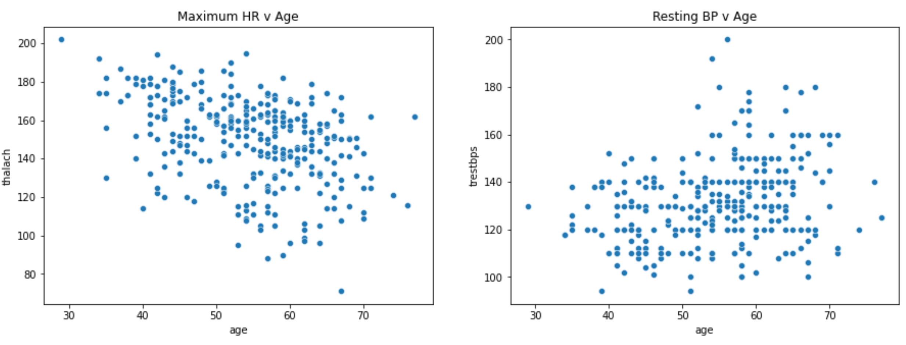
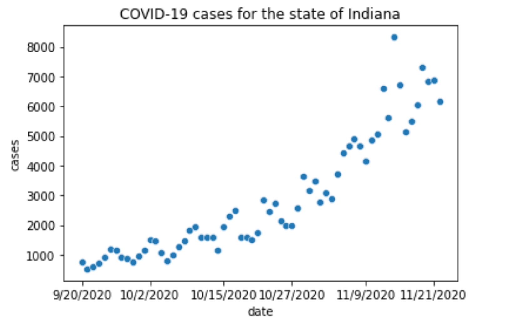
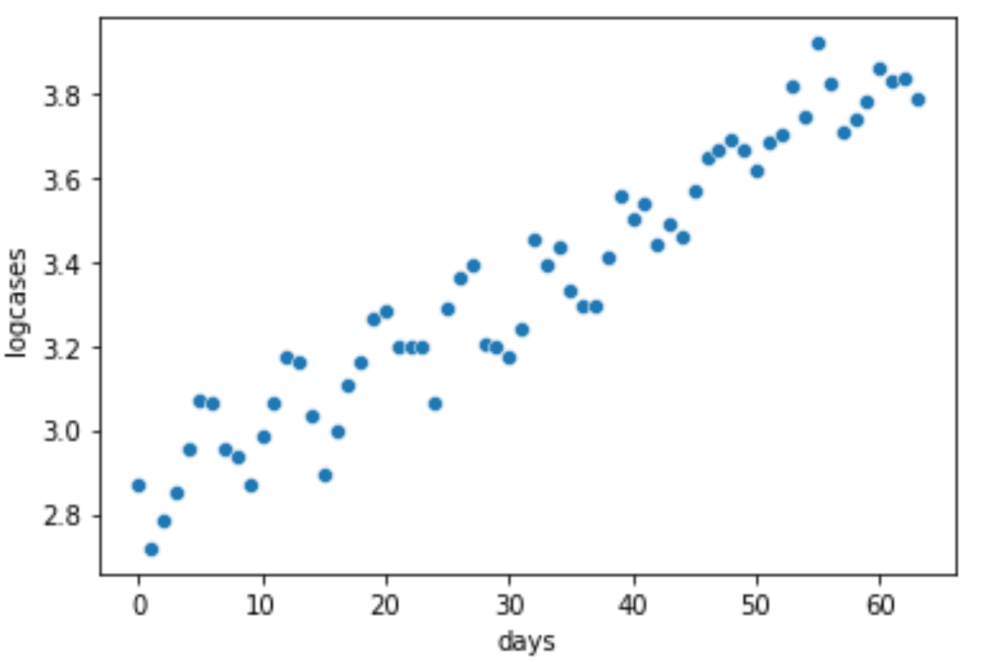
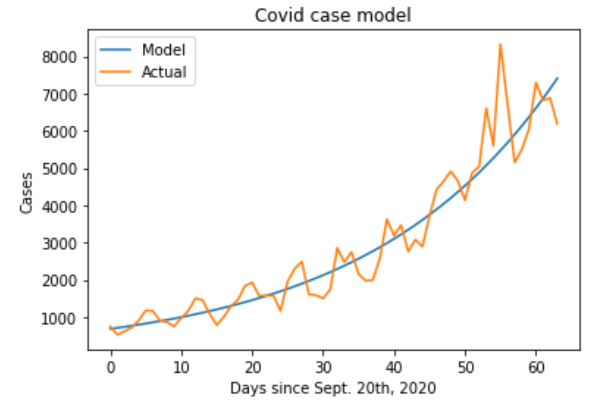
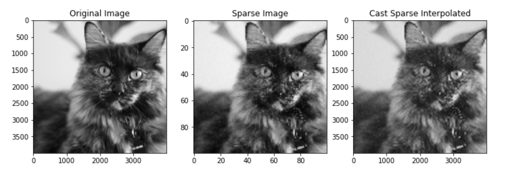
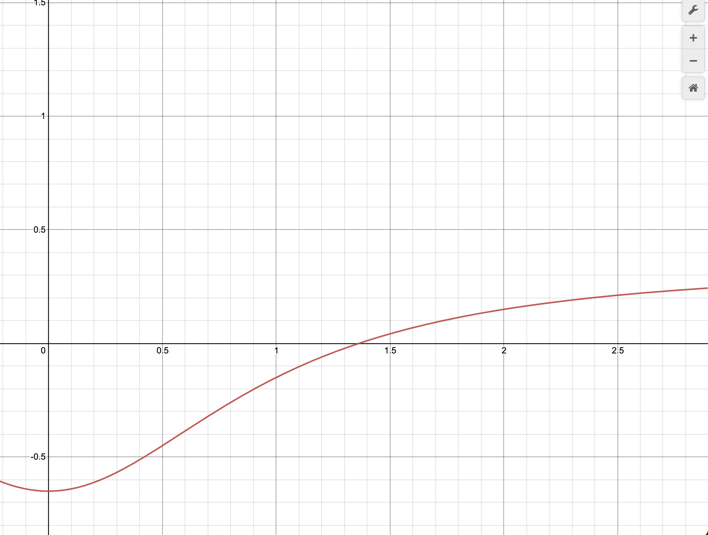
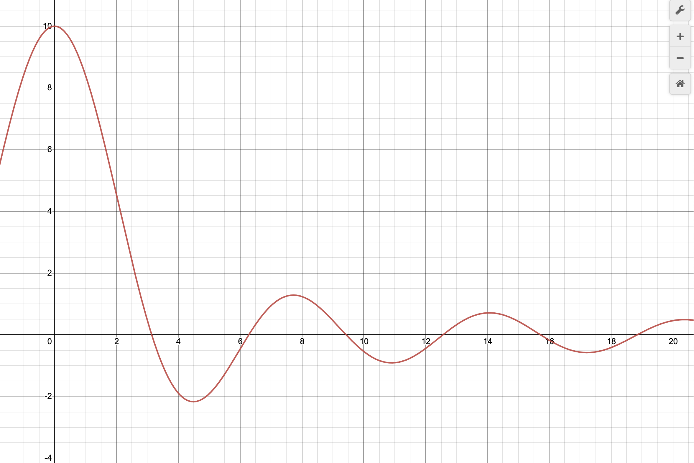

# BME 6310 – Homework 3

## Problem 1
Multiple linear regression is a great tool to use when you have a data set that contains a large set of **independent variables** and one **dependent variable**. It works well to capture mathematical relationships that exist between predictors and outcomes that might not necessarily exist in singular regression analysis alone. Two pitfalls that can be made, however, are non-linear relationships between predictors and outcome variables and colinearities that exist between predictor variables – that is predictor variables that depend on each other. Plots should be made between predictor's to examine possible colinearities. As well, residual plots in the predictor space can indicate the existence of nonlinear relationships in the data. Many robust statistical techniques exist to formalize these processes.

## Problem 2
I was able to find a relatively small sample (n=304) of cardiac vital datapoints for a patient population. For each patient the following metrics were collected:

- Age
- Sex
- Resting blood pressure (mmHg)
- Cholesterol level (mg/dL)
- Maximum heart rate (bps)
- ECH Peak value

I plotted both the **resting blood pressure** and the **cholesterol level** against the patient age:


We can see that there seems to be at least _some_ linear correlation between both variables in relation to a patients age. Using the `sklearn` python package we can fit a multilinear regression to the data using a patients **Resting BP**, **age**, and **cholesterol level**  as _predictor_ variables, with an attempt to predict the patients **maximum heart rate**. Our regression equation will take on the form:

$$
maxHR = c_{0} + c_{1}X_{1} + c_{2}X_{2} + c_{3}X_{3}
$$

Where $X_{1}$, $X_{2}$, and $X_{3}$ are the patients Resting BP in mmHg, Age in years, and Cholesterol level in mg/dL respectively.

The following code was used to generate a multi-linear regression:

```python
from sklearn import linear_model

# init the regression class
regr = linear_model.LinearRegression()

X = heart_data[['trestbps', 'age', 'chol']]
Y = heart_data['thalach']

# fit data to multilinear regression
regr.fit(X, Y)
```

We can extract out the intercept ($c_{0}$) and coefficients to our model like so:

```python
# print out our coefficients
print(f"Regression intercept: {regr.intercept_}")
print(f"Regression coeffs: {regr.coef_}")
print(f"Equation: MaxHR = {regr.intercept_} + X1*{round(regr.coef_[0],2)} + \\
      X2*{round(regr.coef_[1],2)}, where X1 = Resting BP, X2 = Age, and X3 = Cholesterol level")
```

Which produces the following output:

```
Regression intercept: 189.68457189894912
Regression coeffs: [ 0.08485324 -1.09099419  0.03291974]
Equation: MaxHR = 189.68 + X1*0.08 + X2*-1.09 + X3*30.03, 
          where X1 = Resting BP, X2 = Age, and X3 = Cholesterol level
```

Thus, our multi-linear model becomes the equation:

$$
maxHR = 189.68 + 0.08X_{1} - 1.09X_{2} + 30.03X_{3}
$$

The value, now, of our equation being that we can take a patients vitals (namely Resting BP, Age, and Cholesterol) and predict their Maximum Heart Rate value. This is done programmatically like so:

```python
# using the first data point in our set (maxHR = 150)
maxHR = regr.predict([[
    145, # trestbps
    63, # age
    233 # chol
]])

print(f"Predicted max heart rate: {round(maxHR[0])} bps")
```

Which produces:

```
Predicted max heart rate: 141 bps
```

This is not too far off from the actual value of 150bps demonstrating that our model **_could potentially_** be valuable and accurate. A lot more testing would be required, however.

## Problem 3
### The data
A classic (and now extremely relevant) example of a naturally occurring exponential phenomenon is the spread of a virus through a population. A timely example is the spread of SARS-CoV-2 throughout the world. I happen to have some data on COVID-19 cases in the state of Indiana and I'll use that to fit an exponential function. For this dataset, I extracted out a small timeline between **September 20th, 2020**  and **November 22nd, 2020** in order for the exponential fitting to properly work. (i.e. neglecting any pandemic "waves"). Here is the data plotted:

```python
# read in the data
covid_data = pd.read_csv('data/covid.csv')

# plot the data
sns.scatterplot(
    data=covid_data,
    x="date",
    y="cases"
).set(title="COVID-19 cases for the state of Indiana")
```



### Fitting to an exponential
An exponential function takes on the following form:

$$
f(x) = ab^{x}
$$

A common clever technique used to fit data to this type of function is to first **linearize** the function like so:

$$
\log_{10}(f(x)) = \log_{10}(ab^{x}) = \log_{10}a + x\log_{10}b
$$

Which, taking $f(x) = y$, can be rearrange into:

$$
\log_{10}y = (\log_{10}b)x + \log_{10}a
$$

This looks identical to the equation of a line:

$$
y = mx + b
$$

And thus, if we plot $\log_{10}y$ against  $x$ and fit the data using linear regression, we can back calculate the parameters for the original exponential function. I.e.:

$$
m = (\log_{10}b) \rightarrow b = 10^{m}
$$

$$
b = \log_{10}a \rightarrow a = 10^{b}
$$

In python, lets linearize our data and plot the result. Note that, in my model, the value of $x$ is the days since September 20th, 2020. Thus, some calculations are done to reconcile this as our data is given in date format:

```python
from datetime import datetime
date_format = "%m/%d/%Y"

day_zero = datetime.strptime('09/20/2020', date_format)

# linearize data
covid_data['logcases'] = np.log10(covid_data['cases'])

# init a new column
covid_data['days'] = np.zeros(len(covid_data))
covid_data['days'] = [(datetime.strptime(row['date'], date_format) \
    - day_zero).days for (_, row) in covid_data.iterrows()]

# plot to show linear relationship
sns.scatterplot(
    data=covid_data,
    x="days",
    y="logcases"
)
```


We can see now that our data looks **very** linear! Lets use `scipy` again to fit a single variable linear regression to the data:

```python
# init the regression class
covid_lin_regr = linear_model.LinearRegression()

# extract data to fit
X = covid_data[['days']]
y = covid_data['logcases']

# fit
covid_lin_regr.fit(X, y)

# extract params
print(f"Intercept: {covid_lin_regr.intercept_}")
print(f"Slope: {covid_lin_regr.coef_[0]}")
```
```
Intercept: 2.8330092724282654
Slope: 0.016452348797853567
```

Lets use these values to back calculate the parameters $a$ and $b$ for our exponential function. As well, lets plot our fitted function against the original, unlinearized, data:

```python
# calc original params
a = 10**covid_lin_regr.intercept_
b = 10**covid_lin_regr.coef_[0]

# create model
def covid_model(x: int, a:float, b:float) -> float:
    return a*b**x
```



We can see from the above plot that our model is a very nice fit to our data! This model, obviously, breaks down once we reach a peak or new wave of the pandemic.

## Problem 4
To run the decimation and interpolation process, I will be using an image of my cat, Karen:


First we must load in the image, and create a new matrix to store our decimated "sparse" image"

```python
import numpy as np
import matplotlib.pyplot as plt
from scipy import interpolate

DIM = 4000
DECIMATION_FACTOR = ...

# load in image and convert to grayscale and crop
cat = plt.imread('data/karen.png')
cat = np.dot(cat[..., :3], [0.299, 0.587, 0.114])
cat = cat[:DIM,:DIM] # crop image

# create the sparse image
cat_sparse = np.zeros((int(DIM/DECIMATION_FACTOR), int(DIM/DECIMATION_FACTOR)))
```

To make things simpler, I am defining the image dimensions and then also assigning the decimation factor to a variable later. This value will be varied to assess how the decimation and interpolation changes as we alter this value. I will use decimation factors of **10, 40, and 80**. Here is the code to decimate the image:

```python
# decimate the image
for i in range(int(DIM/DECIMATION_FACTOR)):
    for j in range(int(DIM/DECIMATION_FACTOR)):
        cat_sparse[i,j] = cat[i*DECIMATION_FACTOR][j*DECIMATION_FACTOR]
```

Once the image is decimated, we can then interpolate backwards using the `scipy` package `interpolate`:

```python
# Interpolate
Xi, Yi = np.arange(0, DIM, 1), np.arange(0, DIM, 1)
X, Y = np.arange(0, DIM, DECIMATION_FACTOR), np.arange(0, DIM, DECIMATION_FACTOR)

f = interpolate.interp2d(X, Y, cat_sparse, kind='cubic')
cat_sparse_i = f(Xi, Yi)
```

Now we can plot the results at three different decimation levels or decimation factors (**DF**):

### DF = 10


### DF = 40

### DF = 80


As expected, as the decimation factor increases, the picture of Karen becomes more and more pixelated. As well, the final interpolated image is less discernible and more blurry. A decimation factor of 80 showed the biggest relative decrease in quality and you can even see it picking out pixels from area of fur that shoudn't be where they are.

## Problem 5
To calculate the steepest descent, lets first calculate the gradient of the function $f(x)$:

$$
f(x) = x_{1}^{2} + 2x_{2}^{2} – x_{1} – 6x_{2}2
$$

$$
\nabla f(x) = \dfrac{\partial f}{\partial x_{1}}i + \dfrac{\partial f}{\partial x_{2}}j = 
\begin{bmatrix}
    2x_{1} - 1 \\ 4x_{2} - 6
\end{bmatrix}
$$

$$
x_{0} = (0,0)
$$

### Step 1
First, evaluate the gradient at $x_{0}$:

$$
\left. \nabla f(x) \right|_{x=(0,0)}  = \begin{bmatrix} - 1 \\ - 6 \end{bmatrix}
$$

Then we define our new $x_{0}$ values as the following:

$$
x_{1_{new}} = x_{0} + \dfrac{\partial f}{\partial x_{1}}h = 0 -1h = -h \newline
$$
$$
x_{2_{new}} = x_{0} + \dfrac{\partial f}{\partial x_{2}}h = 0 - 6h = -6h
$$

We can plug this into the original equation $f(x)$ to optimize the value of $h$, the amount we take a step:

$$
g(h) = f(x_{1}(h),x_{2}(h)) = (-h)^{2} + 2(-6h)^{2} - (-h) - 6(-6h)
$$

$$
g(h) = h^{2} + 72h^2 + h + 36h = 73h^{2} + 37h
$$

We can then take the derivative of $g(h)$ to optimize the step value:

$$
\dfrac{dg}{dh} = 146h + 37 = 0
$$

Thus,

$$
h = \dfrac{-37}{146} \approx -0.25
$$

We can back calculate using our value of h to get the new values for $x_{1}$ and $x_{2}$:

$$
x_{1_{new}} = x_{0} + \dfrac{\partial f}{\partial x_{1}}h = 0 -1h = -h = 0.25 \newline
$$
$$
x_{2_{new}} = x_{0} + \dfrac{\partial f}{\partial x_{2}}h = 0 - 6h = -6(-0.25) = 1.5
$$

### Step 2
With our new values, we can repeat this entire process:

$$
\left. \nabla f(x) \right|_{x=(0.25,1.5)}  = 
\begin{bmatrix}2(0.25) - 1 \\ 4(1.5) - 6 \end{bmatrix} = 
\begin{bmatrix}-0.5 \\ 0 \end{bmatrix}
$$

And then, we can define our new values using the same process as [step 1](#Step 1):

$$
x_{1_{new}} = x_{0} + \dfrac{\partial f}{\partial x_{1}}h = 0.25 -0.5h \newline
$$
$$
x_{2_{new}} = x_{0} + \dfrac{\partial f}{\partial x_{2}}h = 1.5 + 0h = 1.5
$$

And then create an update $g(h)$:

$$
g(h) = f(x_{1}(h),x_{2}(h)) = (0.25 - 0.5h)^{2} + 2(1.5)^{2} - (0.25 - 0.5h) - 6(1.5)
$$

$$
g(h) = 0.25h^{2} + 0.25h + C
$$

I am neglecting to calculate the constant values as they get dropped anyways in the derivative calculation. Lets now optimize $h$:

$$
\dfrac{dg}{dh} = 0.5h + 0.25
$$

$$
0 = 0.5h + 0.25
$$

$$
h = -0.5
$$

And, finally, we can plug this value of $h$ back into our original equation's's for the new $x$ values:

$$
x_{1_{new}} = x_{0} + \dfrac{\partial f}{\partial x_{1}}h = 0.25 -0.5(-0.5) = 0.5 \newline
$$
$$
x_{2_{new}} = x_{0} + \dfrac{\partial f}{\partial x_{2}}h = 1.5 + 0h = 1.5
$$

We can verify this result using an optimization package in python:

```python
from scipy import optimize

# define function to optimize
def f(x):
    return (x[0]**2) + (2*(x[1]**2)) - x[0] - (6*x[1])

optimize.fmin(f, [0,0])
```

Which produces the following output:
```
Optimization terminated successfully.
         Current function value: -4.750000
         Iterations: 63
         Function evaluations: 120
array([0.50001601, 1.50002605])
```

Which we can see is almost precisely the values we achieved analytically.

## Problem 9
Below is my Newton-Raphson algorithm implemented in Python:

```python
def newton_raphson(func, x: float, tolerance: float = 0.001) -> float:
    """
    Use newton raphson method to estimate the root of an equation
    """
    # estimate zero / calculate error
    h = func(x) / _derivative(func, x)
    
    # while error greater than tolerance
    while abs(h) > tolerance:
        h = func(x) / _derivative(func, x)
        x = x - h
    
    return x
```

I decided to test my algorithm on the **Hill Equation**:

$$
Y = \dfrac{AX^{n}}{K^{n} + X^{n}}
$$

I am going to take $A=1$ and $K=1$ and $n=2$ and shift the function down 0.65 units in order to set up a nice function for root calculation. Here is the function:

$$
Y = \dfrac{X^{2}}{1 + X^{2}} - 0.65
$$



Here is a python implementation of my made-up hill equation:

```python 
def hill(x: float, n: int = 2) -> float:
    """
    Evaluate the hill equation at certain x
    """
    return ((x**n)/(1+x**n) - 0.65)
```

Plugging this into my newton-raphson function, we get the following output:

```python
from nr import *
root = newton_raphson(hill, 1.5)
```
```
The root was found to be: 1.36
```

By eye, we can see that this is pretty close to the actual root value!

## Problem 10
Below is my **Golden Section Search** algorithm implemented in Python:

```python
def gss(func, x_low: float, x_up: float, tolerance: float = 0.0001, loc='max') -> float:
    """
    Implement the golden section search algorithm
    """
    
    # calculate the distance
    # multiplied by the golden
    # ratio
    dist = (x_up-x_low)*GOLDEN_RATIO
    
    # remove this calculated value
    # from the upper value
    # and add to the lower value
    x_2 = x_up - dist
    x_1 = x_low + dist
    
    while abs(x_up - x_low) > tolerance:
        if func(x_1) > func(x_2):
            x_low = x_2
        else:
            x_up = x_1
            
        # calculate the distance
        # multiplied by the golden
        # ratio again
        dist = (x_up - x_low)*GOLDEN_RATIO
        
        # recalculate the bounds
        x_2 = x_up - dist
        x_1 = x_low + dist
        
    # return average between 
    # the two bounds
    return (x_up + x_low) / 2
```

To test this algorithm, I am using the following made-up equation:

$$
f(x) = \dfrac{10}{x}\sin(x)
$$




In order to solve for the maximum of that first hump, I am taking an initial x value of **7**:

```python
from gss import *
 
# implement gss algorithm
maximum = gss(f, 7, 9)
print(f"Maximum found: {round(maximum, 2)}")
```

Which produces the following output:

```
Maximum found: 7.73
```

By eye, we can see that this is pretty close to the x-value that corresponds to our maximum!


